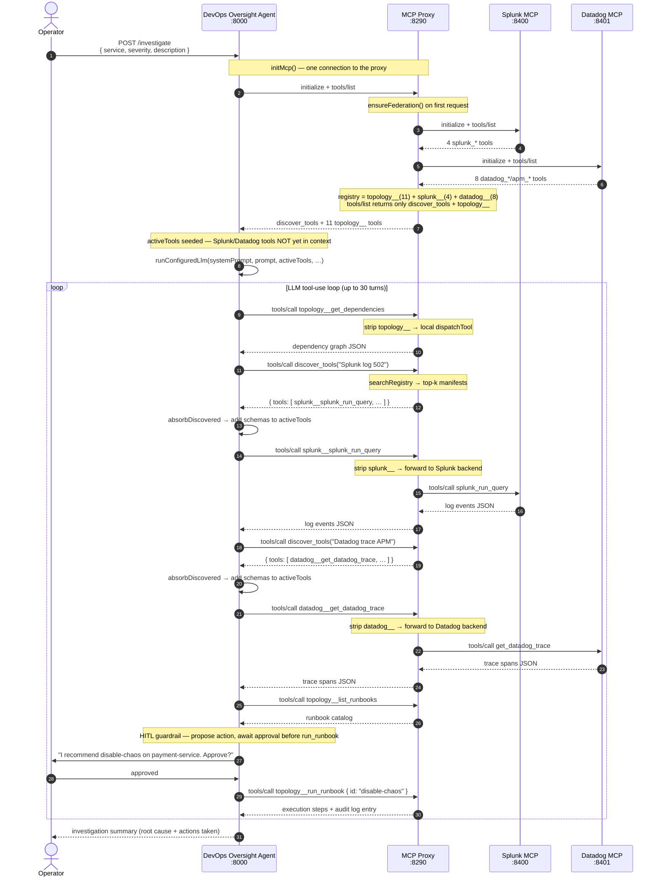

# Sequence Diagram — Overview: Agent → MCP Proxy → Datadog / Splunk

The agent talks to **one** MCP server — the MCP Proxy (`:8290`). The proxy
federates the Splunk (`:8400`) and Datadog (`:8401`) MCP backends and routes each
namespaced tool call to its origin.

Paste the Mermaid block below into [mermaid.live](https://mermaid.live) or any compatible renderer.

## Key points

| Point | Detail |
|-------|--------|
| One connection | The agent opens a single MCP client — to the proxy. It never connects to Splunk/Datadog directly. |
| Proxy federates | On first request the proxy connects to both backends, lists their tools, and namespaces them into its registry (`ensureFederation`, lazy + non-fatal). |
| Lazy loading | `tools/list` returns only `discover_tools` + topology tools; Splunk/Datadog manifests are revealed on demand via `discover_tools`. |
| Prefix routing | The proxy strips `splunk__`/`datadog__`/`topology__` and forwards to the backend (or dispatches locally for topology). |
| HITL guardrail | The system prompt requires operator approval before `run_runbook` is ever called. |
| Mock↔live swap | Point `SPLUNK_MCP_URL`/`DATADOG_MCP_URL` at real SaaS MCPs on the proxy — the agent is unchanged. |
