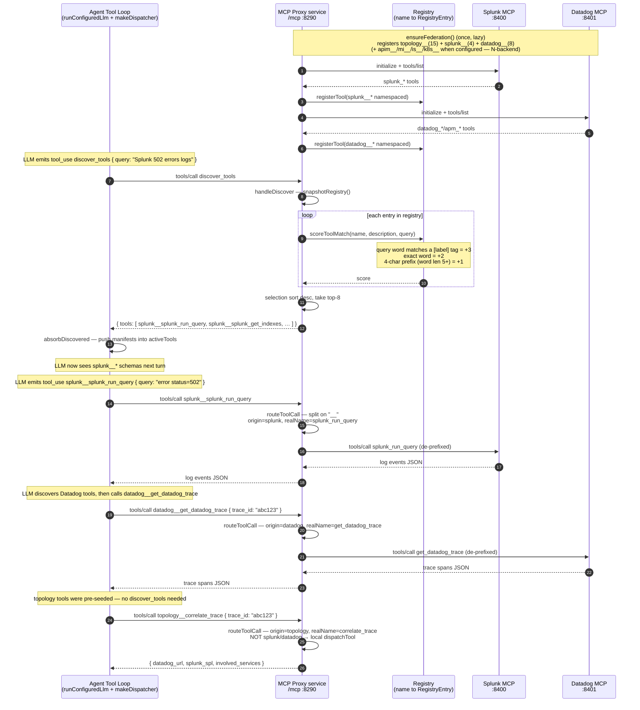

# Sequence Diagram — Tool Routing Detail: Inside the MCP Proxy

This drills into the proxy: how `discover_tools` searches the server-side
registry, how `absorbDiscovered` folds the returned manifests into the agent's
context, and how namespaced calls are prefix-routed to the backends.

Paste the Mermaid block below into [mermaid.live](https://mermaid.live) or any compatible renderer.

## Routing decision table

`routeToolCall` splits the tool name on `__` to get `origin` + `realName`, then:

| origin (prefix) | Target | Example call | Forwarded as |
|-----------------|--------|--------------|--------------|
| `splunk` | Splunk MCP `:8400` | `splunk__splunk_run_query` | `splunk_run_query` |
| `datadog` | Datadog MCP `:8401` | `datadog__get_datadog_trace` | `get_datadog_trace` |
| `apim` / `mi` / `is` / `k8s` | that backend (when configured) | `mi__mi_get_message_processors` | `mi_get_message_processors` |
| `topology` | local `dispatchTool` | `topology__correlate_trace` | `correlate_trace` |

Any registered `<label>__` prefix routes to its backend by the same split-on-`__` rule; `topology__` is the only locally-dispatched prefix. **One exception:** `topology__run_runbook` emitted by the LLM loop is intercepted in the agent's `makeDispatcher` (`approval.bal`) and **never routed to the proxy** — only a separate `approve <token>` chat message reaches the proxy's real `run_runbook` (see the overview diagram's approval gate).

## Where each responsibility lives

| Responsibility | Location | Function |
|----------------|----------|----------|
| Connect to backends, namespace their tools | Proxy | `ensureFederation` / `connectBackend` |
| Hold the searchable tool registry | Proxy | `toolRegistry` (isolated + lock) |
| Score + rank tools for a query | Proxy | `scoreToolMatch` / `searchRegistry` |
| Answer `discover_tools` | Proxy | `handleDiscover` |
| Strip prefix + route the call | Proxy | `routeToolCall` / `callBackend` |
| Fold discovered manifests into LLM context | Agent | `absorbDiscovered` |
| Seed turn-1 tools + run the LLM loop | Agent | `initMcp` / `makeDispatcher` |
| Intercept `run_runbook` (hard approval gate) | Agent | `makeDispatcher` → `interceptRunRunbook` (`approval.bal`); real run only via `handleApprovalCommand` |

## Keyword scorer details

`scoreToolMatch(name, description, query)` concatenates `name + description`,
lowercases both, then tokenizes the query:

- Words ≤ 2 chars: **skip** (stop words)
- Query word matching a tool's `[label]` tag (e.g. `[apim]`, `[runbook]`): **+3** (keeps label-specific queries from being buried as the tool count grows)
- Exact word present in haystack: **+2**
- Word ≥ 5 chars AND its 4-char prefix present: **+1** (handles plurals/stems, e.g. "errors" matches "error")

Tools scoring 0 are excluded; the top-8 by score are returned. This is a
deliberate stand-in for pgvector at ~27 tools (15 topology + 4 splunk + 8 datadog with mock
backends; more once apim/mi/is/k8s federate) — no embedding infrastructure required for the POC.
