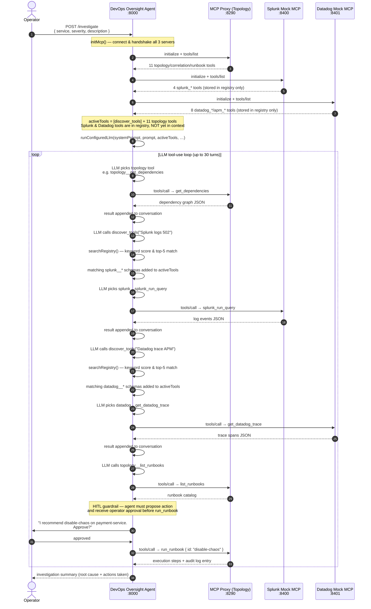

# Sequence Diagram — Overview: Agent → MCP Servers → Datadog / Splunk

Paste the Mermaid block below into [mermaid.live](https://mermaid.live) or any compatible renderer.

## Key points

| Point | Detail |
|-------|--------|
| Three direct connections | The agent connects to all three MCP servers independently — Splunk/Datadog do NOT route through the Topology MCP proxy |
| Lazy loading | Only `discover_tools` + topology tools are in the LLM context at turn 1; Splunk/Datadog schemas load on demand |
| Namespace prefixes | Tools are registered as `splunk__*`, `datadog__*`, `topology__*`; the dispatcher strips the prefix before forwarding |
| HITL guardrail | System prompt requires operator approval before `run_runbook` is ever called |
| maxTurns | Capped at 30 to absorb `discover_tools` round-trips and Ollama non-determinism |
