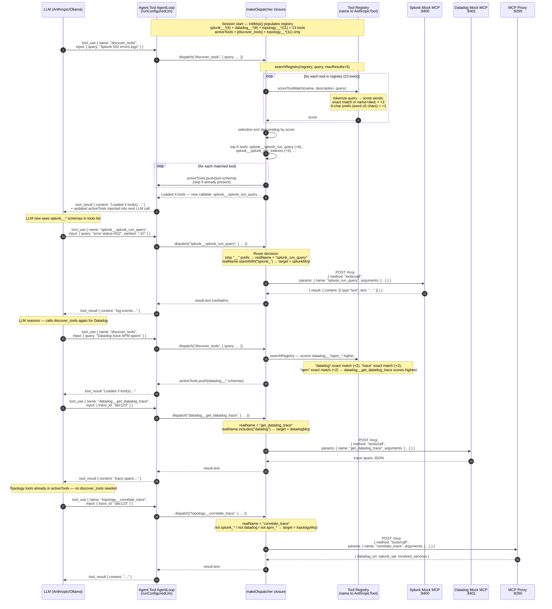

# Sequence Diagram — Tool Routing Detail: discover_tools → Registry → MCP Dispatch

Paste the Mermaid block below into [mermaid.live](https://mermaid.live) or any compatible renderer.

## Routing decision table

The dispatcher strips the `__` namespace prefix to get `realName`, then applies these rules in order:

| Condition on `realName` | Target client | Example tool |
|------------------------|---------------|--------------|
| `startsWith("splunk_")` | `splunkMcp :8400` | `splunk_run_query` |
| `includes("datadog")` OR `startsWith("apm_")` | `datadogMcp :8401` | `get_datadog_trace`, `apm_search_spans` |
| anything else | `topologyMcp :8290` | `correlate_trace`, `run_runbook` |

## Keyword scorer details

`scoreToolMatch(name, description, query)` concatenates `name + description`, lowercases both, then tokenizes the query:

- Words ≤ 2 chars: **skip** (stop words)
- Exact word present in haystack: **+2**
- Word ≥ 5 chars AND its 4-char prefix present: **+1** (handles plurals/stems, e.g. "errors" matches "error")

Tools with score = 0 are excluded. Top-5 by score are added to `activeTools`. This is an intentional choice over pgvector for ~21 tools in a POC — no embedding infrastructure required.
